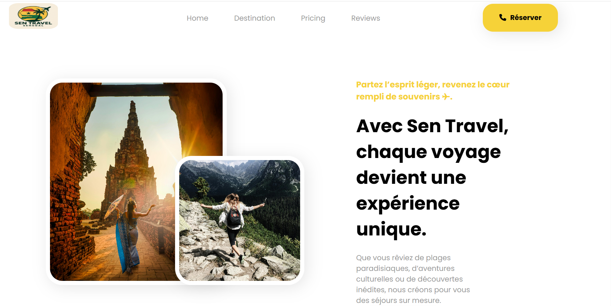
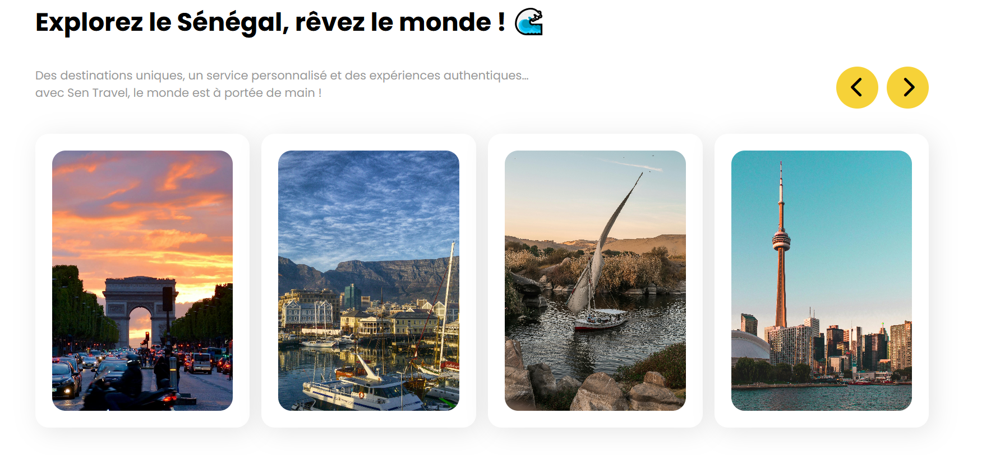
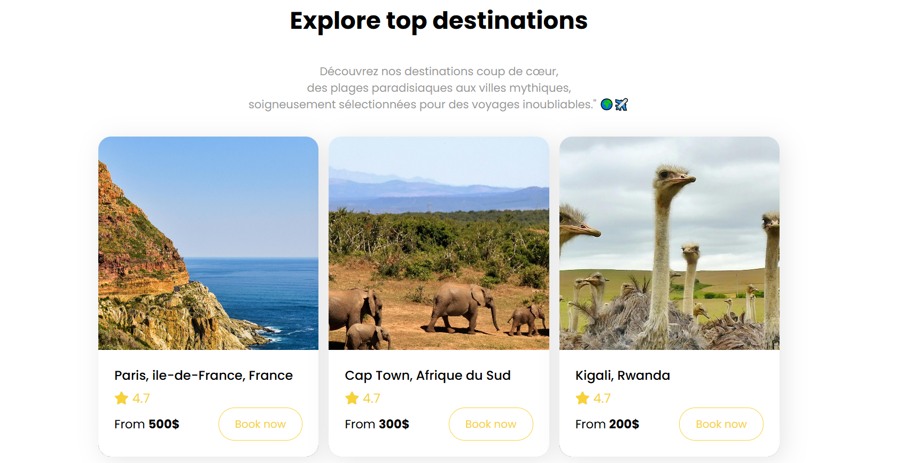
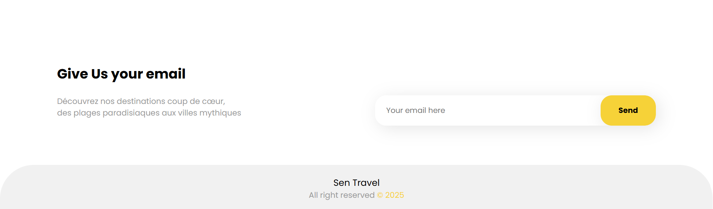

# sen-travel


Bienvenue sur **Sen Travel**, un site vitrine moderne pour une agence de voyage, réalisé en HTML et CSS.

## Aperçu

Sen Travel vous propose de découvrir des destinations uniques, un service personnalisé et des expériences authentiques. Le site présente des destinations phares, des offres de voyage, et permet aux visiteurs de s’inscrire à la newsletter.









## Fonctionnalités

- **Page d’accueil** avec slogan et appel à l’action
- **Galerie de destinations** (France, Afrique du Sud, Égypte, Canada…)
- **Section “Best Trip”** : top destinations avec prix et notes
- **Formulaire d’inscription à la newsletter**
- **Design responsive** adapté aux mobiles et tablettes
- **Icônes FontAwesome** pour une interface moderne

## Structure du projet

```
index.html
style.css
image/
    Canada.jpg
    Egypt.jpg
    Explorer.png
    favicon.ico
    Footer.png
    France.jpg
    Header.png
    image.png
    img.jpg
    img2.jpg
    img3.jpg
    img4.jpg
    img5.jpg
    img6.jpg
    logo.png
    South-Africa.jpg
    Top_Destinations.png
```

## Installation

1. Clonez ce dépôt ou téléchargez-le.
2. Ouvrez `index.html` dans votre navigateur.

Aucune dépendance ni installation supplémentaire n’est requise.

## Personnalisation

- Modifiez les images dans le dossier `image/` pour adapter les destinations.
- Personnalisez les textes dans `index.html` selon vos besoins.
- Adaptez le style dans `style.css` pour correspondre à votre charte graphique.

## Auteur

Projet réalisé par [Djimo Gassama].


## Lien du site pour visiter
[Sen-travel](https://gastech99.github.io/sen-travel/)

---

© 2025 Sen Travel – Tous

